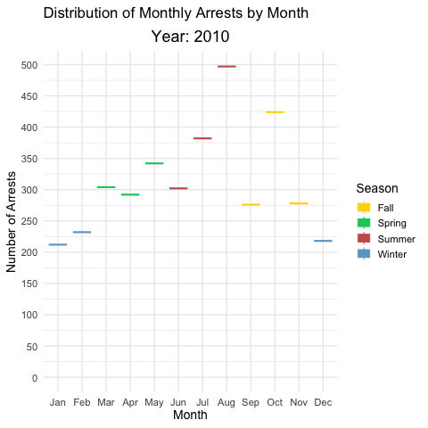
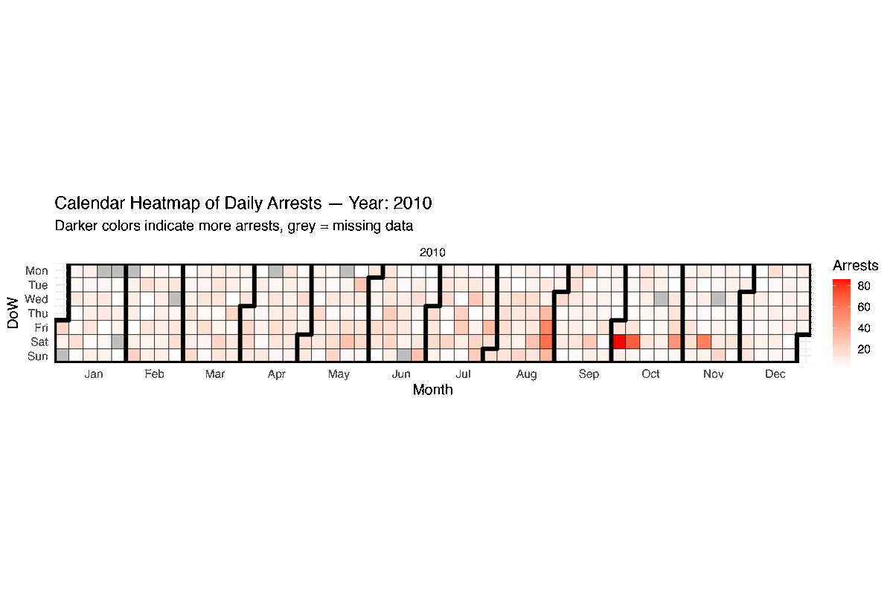

```{r setup, include=FALSE}
knitr::opts_chunk$set(echo = TRUE)
options(scipen = 999)
library(tidyverse)    # loads dplyr, ggplot2, etc.
library(knitr)        # for kable
library(lubridate)    # for date handling
library(ggTimeSeries) # for time series plots
library(viridis)      # color palettes
library(gganimate)
library(gifski)
library(ggmap)

# install.packages("ggTimeSeries")
# install.packages("gganimate")
# install.packages("gifski")    # for rendering
# install.packages("transformr") # required by gganimate
```


# Importing RAW .csv
```{r}
Arrests <- read_csv("Police_Arrests_Clean.csv")
Incidents <- read_csv("Police_Incidents_Clean.csv")
```

*Data Inspection*
```{r}
# Check structure of datasets
glimpse(Arrests)
glimpse(Incidents)

names(Arrests)
names(Incidents)

head(Arrests)
head(Incidents)
```
*Convert dates*
```{r}

Arrests <- Arrests %>%
  mutate(
  ArrestDate = as.Date(Arrest_Date),
  year = year(ArrestDate),
  month_num = month(ArrestDate),
  month = month(ArrestDate, label = TRUE),
  season = case_when(
    month_num %in% c(12, 1, 2)  ~ "Winter",
    month_num %in% c(3, 4, 5)   ~ "Spring",
    month_num %in% c(6, 7, 8)   ~ "Summer",
    month_num %in% c(9, 10, 11) ~ "Fall"
  )
)

Incidents <- Incidents %>%
  mutate(
  IncidentDate = as.Date(Occur_Date),
  year = year(IncidentDate),
  month_num = month(IncidentDate),
  month = month(IncidentDate, label = TRUE),
  season = case_when(
    month_num %in% c(12, 1, 2)  ~ "Winter",
    month_num %in% c(3, 4, 5)   ~ "Spring",
    month_num %in% c(6, 7, 8)   ~ "Summer",
    month_num %in% c(9, 10, 11) ~ "Fall"
  )
)

head(Arrests)
head(Incidents)

```
# Question 1a:Yearly Trend

```{r}
Arrests %>%
  count(year) %>%
  ggplot(aes(x = year, y = n)) +
  geom_line() +
  geom_point() +
  labs(
    title = "Yearly Arrests",
    x = "Year", y = "Number of Arrests"
  ) +
  theme_minimal()
```
```
observations:

- Arrests start high in ~2010, with counts over 3,500 per year.
- Arrest numbers remain relatively stable between ~2010 and 2016, fluctuating slightly between ~3,200–3,600.
- Beginning around 2017–2018, there is a noticeable decline in arrests.
- The drop becomes much sharper around 2019–2021, falling to nearly half of earlier levels — this likely corresponds with the COVID-19 pandemic and lockdowns, when many cities saw decreased police activity and fewer arrests, and also since we are missing arrest data from April to Sepetermber of 2021.
- After 2020, there’s a small rebound, but the counts remain significantly lower than pre-2017 levels.
```

# Question 1b: Monthly Trend
```{r}
Arrests %>%
  count(year, month_num) %>%
  mutate(YearMonth = as.Date(paste(year, month_num, "01", sep = "-"))) %>%
  ggplot(aes(x = YearMonth, y = n)) +
  geom_line() +
  labs(title = "Monthly Arrests Over Time", x = "Year-Month", y = "Number of Arrests") +
  scale_x_date(date_breaks = "6 months", date_labels = "%Y-%m") +
  theme(axis.text.x = element_text(angle = 45, hjust = 1))+
  theme_minimal()
```
```
Observations:

2009–2016:
Arrests fluctuate between ~250–400 per month, with periodic peaks (approaching ~500) and valleys.
There appears to be some seasonality: higher counts in some mid-year (likely summer) months, lower in others (likely winter).

2017–2018:
Monthly counts start to decline gradually compared to earlier years. The peaks are less pronounced, staying mostly below 350.

2019–2020:
Sharp decline begins late 2019 and early 2020 — arrests drop rapidly to below 200 per month.
This drop aligns with the COVID-19 pandemic and lockdowns, when many jurisdictions reduced arrests.

2021–2025:
Counts remain low (~100–150 per month) compared to pre-2019 levels.
There are occasional small spikes, but they stay much lower than earlier years, suggesting a lasting reduction.
```
```
- Stable high activity (2009–2016): Monthly arrests consistently in the 300–400+ range.
- Gradual decline (2017–2018): Decrease starts before COVID.
- Sharp drop (2019–2020): Likely due to pandemic-related restrictions and changes in enforcement.
- Sustained lower levels (2021 onward): Arrests remain at about half or less of their previous levels — indicating potential long-term shifts.
```


*HEAT MAP*
```{r}

Arrests %>%
  count(year, month) %>%
  ggplot(aes(x = month, y = factor(year), fill = n)) +
  geom_tile() +
  scale_fill_gradient(low = "skyblue", high = "darkblue") +
  labs(
    title = "Heatmap of Arrests by Month and Year",
    x = "Month", y = "Year", fill = "Arrests"
  )+
  theme_minimal()
```

```
Observations: 
2010–2016:
Arrest levels are high overall (green to yellow hues) with a clear concentration in summer months (June–August) — particularly July & August, which show the most intense (yellow) spots.
Winter months (January–February, December) consistently show lower levels (blueish shades), which is expected due to seasonality.

2017–2018:
Arrests begin to decline slightly — the heatmap colors shift towards cooler greens and blues even in summer months, suggesting fewer arrests compared to earlier years.

2019–2020:
A dramatic drop appears starting in 2020 — most months, including summer, turn dark blue indicating very low arrest counts.
The drop is most pronounced in spring and summer 2020 — coinciding with COVID-19 restrictions.

2021–2024:
Arrest levels remain low (blue to dark blue), and the distinct summer peaks almost disappear.
The seasonality seems flattened — suggesting the usual summer increase has weakened post-pandemic.

Seasonal pattern:
Consistent before 2017:
- Peaks: June–August
- Lows: January–February & December
Post-2020, this pattern weakens.
```


*Boxplot: Distribution of arrests by month*
```{r}
# Prepare data
monthly_counts <- Arrests %>%
  count(year, month) %>%
  mutate(
    month_num = as.numeric(month),
    # assign season
    season = case_when(
      month_num %in% c(12, 1, 2)  ~ "Winter",
      month_num %in% c(3, 4, 5)   ~ "Spring",
      month_num %in% c(6, 7, 8)   ~ "Summer",
      month_num %in% c(9, 10, 11) ~ "Fall"
    )
  ) %>%
  filter(!is.na(season))   %>%
 mutate(season = droplevels(factor(season)))

# Define seasonal colors
season_colors <- c(
  "Winter" = "skyblue3",
  "Spring" = "springgreen3",
  "Summer" = "indianred",
  "Fall"   = "gold"
)

# Plot
p <- ggplot(monthly_counts, aes(x = month, y = n, fill = season, color = season, group = month)) +
  geom_boxplot() +
  scale_y_continuous(breaks = seq(0, 500, 50)) +
  scale_fill_manual(values = season_colors) +
  scale_color_manual(values = season_colors) +
  labs(
    title = 'Distribution of Monthly Arrests by Month',
    subtitle = 'Year: {current_frame}',
    x = 'Month', y = 'Number of Arrests', fill = "Season", color = "Season"
  ) +
  theme_minimal(base_size = 14) +
  theme(
    plot.subtitle = element_text(size = 18, face = "bold", hjust = 0.5)
  )

# Animate with transition_manual
anim <- p +
  transition_manual(year)

# save animation: 
# animate(anim, width = 900, height = 600, fps = 1, duration = length(unique(monthly_counts$year)) * 4, renderer = gifski_renderer())
# anim_save("animated_boxplot_monthly_arrests_synced.gif")
```
```{r, echo=FALSE, out.width='100%'}

```

```
General Trends:
The boxplots show clear seasonality:
 Winter (Jan–Feb, Dec) — lowest arrests, consistently around ~200–250.
 Spring (Mar–May) — arrests start increasing, reaching ~300–350.
 Summer (Jun–Aug) — peaks, especially July & August, with arrests reaching ~400–500.
 Fall (Sep–Nov) — begins to decline from summer peaks, stabilizing around ~300.

The seasonal pattern is most visible and consistent in the earlier years (2010–2016).
```

```{r}
#checking why no spring and summer in 2020
# List of all years & months in your data

all_months <- month.abb

# All year-month combinations
all_combinations <- expand_grid(
  year = unique(Arrests$year),
  month = all_months
)

# Actual counts
actual_counts <- Arrests %>%
  count(year, month)

# Convert both month columns to character explicitly
all_combinations <- all_combinations %>%
  mutate(month = as.character(month))

actual_counts <- actual_counts %>%
  mutate(month = as.character(month))

# Left join + fill missing with 0
complete_counts <- all_combinations %>%
  left_join(actual_counts, by = c("year", "month")) %>%
  mutate(n = replace_na(n, 0)) %>%
  arrange(year, match(month, all_months))

# Show missing months
missing_months <- complete_counts %>% filter(n == 0)

print(missing_months)

```


*Seasonal barplot*
```{r}
Arrests %>%
  count(year, season) %>%
  filter(!is.na(season)) %>% 
  ggplot(aes(x = factor(year), y = n, fill = season)) +
  geom_bar(stat = "identity", position = "dodge") + 
  scale_fill_manual(values = season_colors) +
  theme_minimal()+
  labs(
    title = "Arrests by Season and Year",
    x = "Year", y = "Number of Arrests", fill = "Season"
  )
```
```
General Observations:
1. In all years, Summer shows the highest number of arrests, peaking around ~1,200 in 2010–2016.
2. Fall and Spring are similar to each other, generally slightly below Summer but still high.
3. Winter consistently has the lowest number of arrests each year — roughly ~50–70% of Summer.

Trend Over Time:
Arrest numbers declined steadily from ~2015 to 2019 across all seasons.
- Summer arrests dropped from ~1,100 in 2014 to ~600–700 by 2019.
- Fall and Spring show a similar downward trend.
- Winter remained the lowest but also declined.

Impact of COVID-19:
In 2020–2021, a dramatic drop is visible in all seasons:
Winter remains low.
Summer and Fall drop sharply, to about ~300 or lower — nearly ¼ of the pre-pandemic peak.
Spring also falls dramatically.
This aligns with what we observed in earlier plots: the pandemic significantly reduced arrests.

Post-2021 (pandemic ends in May 2023):
In 2022–2024, some recovery is observed:
- Slight uptick in Spring and Fall arrests.
- Summer remains much lower than its pre-2020 highs.
- Overall, the seasonal differences are less pronounced in recent years than before 2020.

Seasonal Patterns throughout the years:
Summer > Fall ≈ Spring > Winter
```

*Calendar Heatmap*

```{r}

# Prepare data
daily_arrests <- Arrests %>%
  filter(!is.na(ArrestDate)) %>%
  count(ArrestDate) %>%
  mutate(year = lubridate::year(ArrestDate))

# Get years
years <- sort(unique(daily_arrests$year))

# Loop: save PNG for each year
for (yr in years) {
  cat("Rendering year:", yr, "\n")
  
  p <- ggplot_calendar_heatmap(
      daily_arrests %>% filter(year == yr),
      'ArrestDate',
      'n'
    ) +
    scale_fill_gradient(low = "white", high = "red", name = "Arrests", na.value = "grey") +
    labs(
      title = sprintf("Calendar Heatmap of Daily Arrests — Year: %s", yr),
      subtitle = "Darker colors indicate more arrests, grey = missing data"
    ) +
    theme_minimal(base_size = 14)
  
 # ggsave(sprintf("calendar_%s.png", yr), plot = p, width = 12, height = 8)
}

```
```{r}
imgs <- list.files(
  path = "heat map calendar for each year",
  pattern = "\\.png$",
  full.names = TRUE
) |> sort()

length(imgs)
output_gif <- "calendar_heatmap_animation.gif"

gifski(
  png_files = imgs,
  gif_file = output_gif,
  delay = 2,   # adjust speed (seconds per frame)
  width = 1200,
  height = 800,
  loop = TRUE
)

```
```{r, echo=FALSE, out.width='100%'}

```

# Question 2:  frequency and type of crime change across months and ZIP codes

```{r}
Incidents <- Incidents %>%
  mutate(
    Date = as.Date(Occur_Date),           # adjust as needed
    Month = month(Date, label = TRUE),
    Year = year(Date)
  ) %>%
  filter(!is.na(Latitude) & !is.na(Longitude)) # keep valid rows
```


